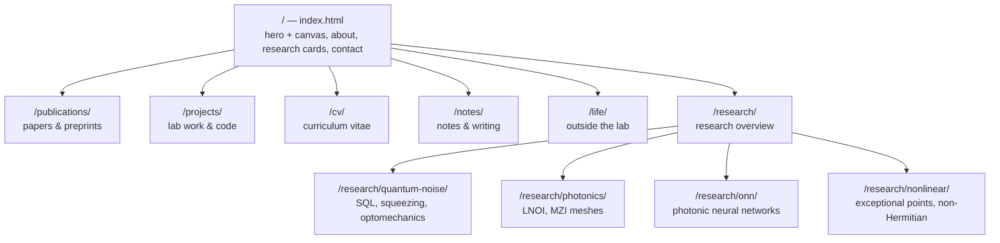

# PROJECT.md — Site Map & Working Memory

## Summary

Personal academic website of **Aleksandr Movsisian** — PhD researcher at KAUST
(Integrated Photonics Lab, Prof. Yating Wan), previously MSU and EPFL
(Kippenberg Lab). The site presents his research (quantum noise &
optomechanics, integrated photonics, photonic neural networks, nonlinear
optics), publications, projects, CV, notes/writing, and life outside the lab.
Pure HTML/CSS/JS with no build step, deployed via GitHub Pages from
`AleksandrMovsisian/AleksandrMovsisian.github.io` to
https://aleksandrmovsisian.github.io. The design goal: warm and personal
("тепло и лампово"), muted warm-grey palette, with all visual energy in the
interactive Photon Crystal canvas animation on the home page.

## Folder structure

| Path | Purpose | Status | Notes |
|---|---|---|---|
| `index.html` | Home: hero + canvas, about, research cards, notes, contact | live | Warm grey, 538 lines, inline CSS + canvas JS. NEVER regenerate — surgical edits only |
| `photo.jpg` | Hero photo | live | Referenced from home page |
| `assets/style.css` | Shared styles for legacy subpages | legacy | Old dark theme (Fraunces/Outfit) — only legacy subpages use it |
| `assets/main.js` | Scroll-reveal script for legacy subpages | legacy | 5 lines, IntersectionObserver |
| `publications/` | Publication list | legacy | Old dark design, placeholder content ("A. Lastname") |
| `projects/` | Projects & lab work | legacy | Old dark design, real project descriptions |
| `cv/` | Curriculum vitae | legacy | Old dark design, partly real content (KAUST/MSU/EPFL) |
| `notes/` | Notes & blog index (ex-blog.html) | legacy | Old dark design, sample post list |
| `life/` | Life outside the lab | placeholder | New warm-grey stub |
| `research/` | Research overview | placeholder | New warm-grey stub, links to 4 directions |
| `research/quantum-noise/` | Quantum Noise & Optomechanics | placeholder | New warm-grey stub |
| `research/photonics/` | Integrated Photonics | placeholder | New warm-grey stub |
| `research/onn/` | Photonic Neural Networks | placeholder | New warm-grey stub |
| `research/nonlinear/` | Nonlinear Optics | placeholder | New warm-grey stub |
| `_docs/` | Working docs (session summary, diagnostic report) | — | Gitignored, never deployed |
| `PROJECT.md` | This file — project map, maintained by the agent | — | Committed to repo |

Each page folder also contains a `NOTES.md` (working notes: status, todos,
open questions, content drafts) — for Aleksandr's own use.

## Navigation scheme



All nav links use folder URLs without `.html` (e.g. `/publications/`,
`/research/onn/`). Home-page research cards link directly to the four
research subpages.

## Design tokens (locked in)

```css
--bg: #eae7e2;        /* warm grey background */
--surface: #f3f0ec;   /* card backgrounds */
--elevated: #e2dfda;  /* elevated surfaces */
--text: #1e1c1a;      /* primary text */
--soft: #585450;      /* secondary text */
--dim: #948e88;       /* muted text */
--accent: #3a3530;    /* primary accent */
--accent2: #807a74;   /* secondary accent */
--border: #d6d2cc;    /* borders */
--border-light: #c6c2bc;
/* nav bar: paper #d5c4aa with SVG fractal-noise grain, border #b8a890 */
```

Fonts: **Source Serif 4** (headings), **DM Sans** (body), **JetBrains Mono**
(labels, tags, dates). The interactive **Photon Crystal animation** (13 real
nonlinear crystals, SHG/SPDC cascades, entanglement, vacuum fluctuations)
lives in `index.html` as inline JS at the bottom — physics verified, never
regenerate, surgical edits only. Full design history in
`_docs/website-session-summary.md`.

## Recent changes

- **2026-06-12** — Replaced hero tagline with the personal version ("This is
  my corner of the internet…"), commit `225da56`. Verified all nav targets
  and research card links resolve — no 404s remain.
- **2026-06-12** — Restructured to per-page folders: subpages moved to
  `publications/`, `projects/`, `cv/`, `notes/` (old dark design kept,
  asset paths and nav links updated); shared assets moved to `assets/`;
  new warm-grey placeholders created for `life/`, `research/` and its four
  subpages; `NOTES.md` added to every page folder; nav switched to folder
  URLs; "About" removed from home nav (about lives on the home page);
  PROJECT.md created; README.md replaced with short version.
- **2026-06-12** — Cleanup: deleted local junk drafts, moved working docs
  to gitignored `_docs/`.
- **2026-06-12** — Deployed warm-grey redesign with Photon Crystal canvas
  (commit `3e63dcc`): promoted to `index.html`, added `photo.jpg` and
  `.gitignore`, synced local repo with remote history.
- **2026-03-16** — Initial deploy of the old dark-theme site (3 commits).

## For the agent

Standing rules for any agent session working on this project:

1. **At the start of every session, read PROJECT.md first** to load context.
2. **After every set of changes, update PROJECT.md**: folder structure
   table, navigation diagram (if structure changed), recent changes log,
   and page statuses.
3. **At the end of every session, ask Aleksandr:** "Is there new info I
   should add to PROJECT.md?"

Additional invariants:

- `index.html` is never regenerated from scratch; all edits are surgical.
- Old-design (legacy) pages keep their design until an explicit redesign
  task; only paths/links change during restructures.
- `_docs/` is gitignored working material — never commit or deploy it.
- File content stays in English; conversation with Aleksandr can be
  Russian or English.
