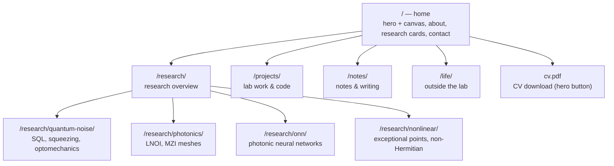

# PROJECT.md — Master Project Document

> Source of truth for the state of this project. Read fully before doing
> anything. See "For a future Claude session" at the bottom.

## (a) Overview

Personal academic website of **Aleksandr Movsisian** — physicist (quantum
optics / photonics), PhD researcher at KAUST Integrated Photonics Lab
(Prof. Yating Wan); previously MSU (Vyatchanin group, quantum measurement
theory) and EPFL (Kippenberg Lab, cavity optomechanics & squeezed light).

- **Live site:** https://aleksandrmovsisian.github.io
- **Repo:** https://github.com/AleksandrMovsisian/AleksandrMovsisian.github.io
- **Local path:** `C:\Users\Александр\OneDrive\Рабочий стол\personal-site`

The site presents research, publications, projects, CV, notes/writing, and
life outside the lab. Design goal: warm and personal ("тепло и лампово"),
muted warm-grey palette, with all the visual energy in the interactive
Photon Crystal canvas on the home page.

## (b) Tech stack & constraints

- **Pure static HTML/CSS/JS.** No build tools, no frameworks, no
  dependencies beyond Google Fonts CDN.
- **Hosting:** GitHub Pages from `main` branch root. Pages serves
  `index.html` from each folder, so `/publications/` →
  `publications/index.html`. URLs use folder form without `.html`.
- **Workflow:** local edit → `git add <files>` (explicit, no wildcards) →
  `git commit` → `git push origin main` → Pages auto-rebuilds in ~1–2 min.
- **Local preview:** `python -m http.server 8000` → http://localhost:8000.
  (Note: absolute links like `/publications/` resolve correctly when served
  from the project root.)
- **Known risk:** the repo lives inside a OneDrive-synced folder. OneDrive
  may dematerialize files ("free up space") or cause sync churn on `.git`.
  Files are currently all on-disk. Long-term: consider moving out of
  OneDrive or marking "Always keep on this device".

## (c) Design system (values read from index.html)

### Warm grey palette (CSS variables, `:root` in index.html)

```css
--bg: #eae7e2;          /* main background */
--surface: #f3f0ec;     /* card backgrounds */
--elevated: #e2dfda;    /* elevated surfaces / tag chips */
--text: #1e1c1a;        /* primary text */
--soft: #585450;        /* secondary text */
--dim: #948e88;         /* muted text */
--accent: #3a3530;      /* primary accent (dark warm) */
--accent2: #807a74;     /* secondary accent */
--border: #d6d2cc;      /* borders */
--border-light: #c6c2bc;/* lighter borders, ghost numerals */
```

Nav bar (outside variables): paper background `#d5c4aa` with an SVG
fractal-noise grain texture (feTurbulence, opacity 0.14), bottom border
`#b8a890`, height 78px.

### Fonts

- **Source Serif 4** — headings, name, section titles (`--serif`)
- **DM Sans** — body text, nav, buttons (`--sans`)
- **JetBrains Mono** — labels, tags, dates, path nodes (`--mono`)

Loaded via a single Google Fonts `<link>` in each page's `<head>`
(index.html line 7). Placeholder pages load the same three families with a
reduced weight set.

### Typography scale (from index.html)

- Body: 20px, line-height 1.8
- Hero name (h1): `clamp(3.6rem, 7.5vw, 5.5rem)`, weight 400
- Hero tagline: 1.35rem
- Section titles: 3.1rem, weight 700
- Section labels: 0.82rem mono uppercase
- About text: 1.2rem; research card titles: 1.4rem; card text: 1.08rem
- Buttons: 1.02rem; nav links: 1.1rem; nav logo: 1.5rem
- Contact heading: 2.6rem

### Photon Crystal Simulation (hero canvas)

Interactive nonlinear-optics animation on the home-page hero **only**.
Click → a photon spawns and flies to the nearest crystal → nonlinear
process cascade. 13 hexagonal crystals of real materials (BBO, KTP,
LiNbO₃/PPLN, BiBO, KDP, PPKTP), each labeled SHG or SPDC. Physics is
verified-correct: SHG accumulates 2 pump photons (ω and k add vectorially,
noise adds coherently); SPDC splits 1 pump into signal+idler with strict
energy/momentum conservation and anti-correlated noise; entanglement is
preserved through cascades; vacuum fluctuation pairs appear randomly;
color encodes frequency. Lives as **inline JS at the bottom of
index.html** (functions `placeCrystals`, `spawnSHG`, `spawnSPDC`,
`hitCrystal`, `frame`). **Never regenerate this file — surgical edits
only.** Full parameter history: `_docs/website-session-summary.md`.

## (d) Current file structure

```
personal-site/                      (= git repo root)
├── .git/
├── .gitignore        tracked   — ignores _docs/, _reports/, *.bak, *.tmp
├── index.html        tracked   — home page: hero+canvas, about, research cards, notes, contact (533 lines)
├── cv.pdf            tracked   — CV download target (hero "CV ↓" button)
├── photo.jpg         tracked   — hero photo
├── PROJECT.md        tracked   — this file
├── README.md         tracked   — short: quick start + pointer here
├── _docs/            GITIGNORED — working docs (website-session-summary.md, DIAGNOSTIC-REPORT.md)
├── _reports/         GITIGNORED — per-stage session reports for Aleksandr
├── assets/
│   ├── style.css     tracked   — OLD dark-theme stylesheet, used only by legacy subpages
│   └── main.js       tracked   — scroll-reveal (IntersectionObserver), used by legacy subpages
├── projects/         index.html (legacy) + NOTES.md     tracked
├── notes/            index.html (legacy, ex-blog) + NOTES.md  tracked
├── life/             index.html (warm-grey placeholder) + NOTES.md  tracked
└── research/         index.html (warm-grey overview) + NOTES.md     tracked
    ├── quantum-noise/  index.html + NOTES.md   tracked
    ├── photonics/      index.html + NOTES.md   tracked
    ├── onn/            index.html + NOTES.md   tracked
    └── nonlinear/      index.html + NOTES.md   tracked
```

Each page folder has a `NOTES.md` (status / todos / open questions /
content drafts) — Aleksandr's working notes, tracked by git.

## (e) Page inventory

| Path | Purpose | Status | Design state |
|---|---|---|---|
| `/` (index.html) | Home: hero + canvas, about, research cards, contact | live | warm-grey |
| `/projects/` | Lab work & code | legacy | dark-theme, real project descriptions |
| `/notes/` | Notes & writing index | legacy | dark-theme, sample posts |
| `cv.pdf` | CV download (hero button) | live | PDF file at root |
| `/life/` | Life outside the lab | placeholder | warm-grey |
| `/research/` | Research overview + links to 4 directions | placeholder | warm-grey |
| `/research/quantum-noise/` | Quantum Noise & Optomechanics | placeholder | warm-grey |
| `/research/photonics/` | Integrated Photonics | placeholder | warm-grey |
| `/research/onn/` | Photonic Neural Networks | placeholder | warm-grey |
| `/research/nonlinear/` | Nonlinear Optics | placeholder | warm-grey |

## (f) Navigation scheme

Nav (four items) and hero are shown solid; the CV button is a direct PDF
download; research cards link into the research subpages.



Nav links: Research, Projects, Notes, Life. The hero "CV ↓" button
downloads `cv.pdf`. Home-page research cards link directly to the four
research subpages. `/publications/` and `/cv/` are dropped (pending file
removal). All internal links use absolute folder URLs (`/research/onn/`).

## (g) History

- **2026-03-16** — Initial site pushed: dark theme (`#1c1b22`,
  Fraunces/Outfit), "Aleksandr Lastname" placeholders. 3 commits.
- **2026-03 – 2026-06** — Warm-grey redesign built locally (palette, fonts,
  Photon Crystal canvas), iterated through draft files; **never pushed** —
  the local folder was assembled from manual downloads and its git repo had
  no commits and no shared history with the remote.
- **2026-06-11/12** — Full diagnostic confirmed the above as the root cause
  of the stale live site. Fixed: `git fetch` + `git reset origin/main`
  attached local work to remote history without touching files.
- **2026-06-12** — `3e63dcc` Deployed warm-grey redesign: promoted the
  current draft to `index.html`, added `photo.jpg`, `.gitignore`.
- **2026-06-12** — `48228e0` Cleanup: deleted junk draft files, moved
  working docs to gitignored `_docs/`.
- **2026-06-12** — `3d77282` Restructured to per-page folders
  (`publications/`, `projects/`, `cv/`, `notes/`, `life/`, `research/*`),
  moved shared assets to `assets/`, created warm-grey placeholders and
  per-folder NOTES.md, switched nav to folder URLs, removed "About" from
  nav (about lives on home), created PROJECT.md, shortened README.
- **2026-06-12** — `225da56` Replaced hero tagline with the personal
  version ("This is my corner of the internet…"); `8b2fe47` logged it.
  Verified all nav and research-card targets resolve — no 404s.
- **2026-06-12** — Upgraded PROJECT.md to this detailed master-document
  format; added `_reports/` (gitignored) for per-stage session reports.
- **2026-06-16** — `01963fa` Home-page hero & nav: name shortened to
  "Aleksandr" (surname/`.hl` span removed); hero reduced to two buttons
  (More about me; CV ↓ → `cv.pdf` with `download`), Publications button
  removed; nav trimmed to four items (Research, Projects, Notes, Life);
  RQC node removed from the path row. Cross-checked the site against the
  real CV; renamed `CV_Movsisian_Aleksandr.pdf` → `cv.pdf`; deleted the
  now-orphaned `publications/` and `cv/` folders.
- **2026-06-16** — Home-page about section rewritten: two new bio
  paragraphs (BSc+MSc at MSU; EPFL; a year at KAUST; now Research Assistant
  in the Photonics Lab at ETH Zurich; plus a cross-fields/curiosity line);
  old "Outside the lab…" paragraph removed (content moving to the Life
  page); path row → `MSU → EPFL → KAUST → ETH Zurich`; quick links given
  real URLs (Scholar, GitHub, LinkedIn with `target="_blank" rel="noopener"`;
  Email `mailto:`).

## (h) Known issues / risks

- **OneDrive:** repo inside a synced folder — risk of sync conflicts on
  `.git` and of files being dematerialized to cloud-only placeholders.
- **Visual inconsistency:** the two remaining legacy subpages (projects,
  notes) still use the old dark theme and contain "Aleksandr Lastname"
  placeholder footers — jarring next to the warm-grey home page.
- **Dead external links:** the about-section quick links (Scholar, GitHub,
  LinkedIn, Email) now have real URLs. Remaining `href="#"` stubs: the
  contact section and the notes "find me elsewhere" row (Scholar, GitHub,
  LinkedIn, Twitter/X, Telegram).
- **Current position is slightly ahead of the CV:** the site now states
  ETH Zurich (Photonics Lab) as the current role in both the bio and the
  path row. The CV lists ETH as Jul 2026–present (Prof. Lukas Novotny), so
  as of mid-June 2026 this is a near-future move stated as present —
  Aleksandr's choice.
- **Home-page content debt** (decisions in
  `_docs/website-session-summary.md`): optional "Biography" label and
  "Currently at" line not yet added. (Bio text rewritten and RQC path node
  removed 2026-06-16.)
- No favicon, no Open Graph meta tags, no sitemap.

## (i) Roadmap / TODO

1. Redesign the two legacy subpages (projects, notes) to the warm-grey
   design system.
2. Fill real content: project details, the four research detail pages,
   life page.
3. Optional home-page polish: "Biography" label, "Currently at" line.
   (ETH Zurich now set as current position; bio rewritten 2026-06-16.)
4. Replace `href="#"` external links with real URLs (Scholar, GitHub,
   LinkedIn, …). CV PDF now present (`cv.pdf` after the cleanup rename).
5. Consider moving the repo out of OneDrive (e.g. `C:\code\`).
6. Nice-to-haves: favicon, Open Graph tags, sitemap.xml.

## (j) For a future Claude session

If this file is uploaded to a new chat or read at the start of a session:

1. **Read PROJECT.md fully first** — it is the source of truth for project
   state. Design history details live in `_docs/website-session-summary.md`.
2. **`index.html` is never regenerated from scratch.** All edits are
   surgical string replacements. The inline canvas JS (Photon Crystal
   Simulation) must be preserved exactly. Verify integrity after edits:
   line count (~538), markers `--bg: #eae7e2`, `spawnSHG`, `spawnSPDC`,
   `Source Serif 4`, file ends `</body></html>`.
3. **After any change, update PROJECT.md**: file tree (d), page inventory
   (e), navigation diagram (f) if structure changed, history log (g),
   roadmap (i).
4. **Write a stage report** to `_reports/STAGE-N-report.md` after each
   work stage (what was done, file changes with line counts, git
   operations, verification results, anything unexpected).
5. **Git discipline:** explicit `git add <file>` per file — never
   `git add -A` or `git add .`. `_docs/` and `_reports/` are gitignored
   and never committed. Each work stage needs Aleksandr's confirmation
   before commit/push.
6. **At the end of every session, ask Aleksandr:** "Is there new info I
   should add to PROJECT.md?"
7. Conversation may be in Russian or English; all file content stays in
   English.
